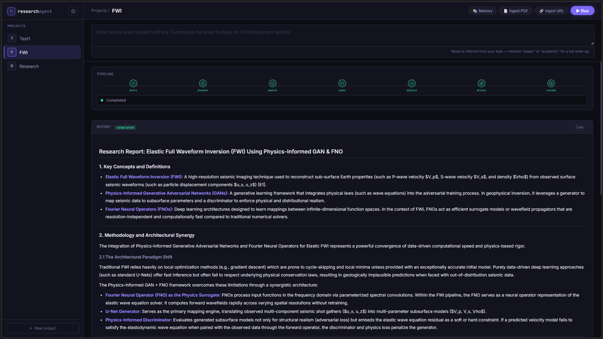

# Cognita: Research Assistant

A multi-agent research pipeline that takes a plain-language research task, autonomously plans and executes it through a graph of specialised agents, and produces a cited, reviewed report. Built on LangGraph, FastAPI, PostgreSQL + pgvector, Neo4j (via Graphiti), and a sandboxed Python execution environment.


## Table of Contents

1. [How to Run](#how-to-run)
2. [Architecture Overview](#architecture-overview)
3. [The Agent Graph](#the-agent-graph)
4. [Agents — What Each One Does](#agents--what-each-one-does)
5. [Memory System](#memory-system)
6. [RAG Pipeline](#rag-pipeline)
7. [Evidence & Citations](#evidence--citations)
8. [LLM Backends](#llm-backends)
9. [Observability](#observability)
10. [API Reference](#api-reference)
11. [Known Issues & Quirks](#known-issues--quirks)

---

## How to Run

### Prerequisites

- Python 3.12+
- [uv](https://github.com/astral-sh/uv) (package manager)
- Docker (for the code sandbox and infrastructure)
- A Google Gemini API key
- A Tavily API key (web search)
- Langfuse instance (self-hosted or cloud) for tracing

### 1. Start infrastructure
```bash
cp .env.example .env   # fill in your values — see env vars below
docker compose up -d   # starts PostgreSQL (pgvector) + Neo4j
```

### 2. Build the code sandbox image
The coder agent runs generated Python in a locked-down Docker container. Build it once:
```bash
docker build -t research-sandbox tools/sandbox/
```

### 3. Install dependencies
```bash
uv sync
```

### 4. Initialise the database, only once
```bash
uv run python -c "from config.init_db import init_db; init_db()"
```

### 5. Start the server
```bash
uv run uvicorn app.api:app --host 0.0.0.0 --port 8000 --reload
```

Open `http://localhost:8000/ui` in your browser.

---

### Environment Variables

All variables are validated at startup via Pydantic. The server refuses to start if any required field is missing or empty.

| Variable | Required | Description |
|---|---|---|
| `GEMINI_API_KEY` | ✓ | Google Gemini API key |
| `LLM_MODEL` | ✓ | Model string, e.g. `gemini-3.5-flash` (see [LLM Backends](#llm-backends)) |
| `LLM_BACKEND` | ✓ | `gemini`, `openrouter`, or `local` |
| `OPEN_ROUTER_API_KEY` | ✓ | OpenRouter key (required even if not using OpenRouter — see [Known Issues](#known-issues--quirks)) |
| `OPEN_ROUTER_MODEL` | ✓ | OpenRouter model string |
| `TAVILY_API_KEY` | ✓ | Tavily web search key |
| `FASTAPI_API_KEY` | ✓ | Static key sent as `X-API-Key` header from the UI |
| `DATABASE_USERNAME` | ✓ | Postgres username |
| `DATABASE_PASSWORD` | ✓ | Postgres password |
| `DATABASE_NAME` | ✓ | Postgres database name |
| `DATABASE_HOST` | – | Defaults to `localhost` |
| `NEO4J_URI` | – | Defaults to `bolt://localhost:17687` |
| `NEO4J_USER` | – | Defaults to `neo4j` |
| `NEO4J_PASSWORD` | ✓ | Neo4j password |
| `LANGFUSE_PUBLIC_KEY` | ✓ | Langfuse project public key |
| `LANGFUSE_SECRET_KEY` | ✓ | Langfuse project secret key |
| `LANGFUSE_BASE_URL` | ✓ | Langfuse host URL |
| `ENABLE_RERANKER` | – | `true` to enable cross-encoder reranking (slower, better retrieval) |
| `RERANKER_TOP_K` | – | How many results to keep after reranking. Defaults to `5` |

*As the validate function validates all Variables at startup, aspects you are not currently using - random strings can be assigned to them for the time being*

---

## Architecture Overview

```
Browser (index.html)
        │  REST + polling
        ▼
FastAPI (app/api.py)
        │  BackgroundTask
        ▼
LangGraph graph (graphs/graph.py)
        │
   ┌────┴────────────────────────────────────┐
   │  entry → planner → [researcher|coder|   │
   │          analyst|critic] → planner loop │
   │          → writer → reviewer loop       │
   └─────────────────────────────────────────┘
        │
        ├── PostgreSQL (pgvector)   — embeddings, runs, summaries, chat
        ├── Neo4j (via Graphiti)    — knowledge graph of research episodes
        ├── Docker sandbox          — isolated Python execution
        └── Langfuse                — LLM call tracing
```

Runs are executed in a `threading.Thread` (FastAPI `BackgroundTasks`). The browser polls `/runs/{run_id}` every few seconds to pick up status and the agent currently running. The final report is written to both the `runs.final_output` column and a file on disk at `data/projects/{id}/runs/{run_id}/outputs/final_report.md`.

---

## The Agent Graph

```
START → entry → planner ──┬──→ researcher → planner (loop)
                           ├──→ coder      → planner (loop)
                           ├──→ analyst    → planner (loop)
                           ├──→ critic     → planner (loop)
                           └──→ end ──→ writer → reviewer ──┬──→ END
                                                            └──→ writer (revision loop, max 3)
```

The planner decides routing at every step by reading the full current state (what's done, what's missing, what the reviewer said). The writer → reviewer loop runs up to `MAX_REVISIONS = 3` times before the reviewer force-accepts to prevent infinite loops.

---

## Agents — What Each One Does

### Entry
Initialises the run. Adds the user's task to the message history and resets `revision_count` to 0. Runs once at the start of every run.

### Planner
The brain of the pipeline. Reads the full state and decides which agent to call next. Derives `task_mode` (`summary` or `paper`) from the task text — if the task contains words like "paper", "academic", "publish", or "write up", it routes to paper mode, which includes a novelty check via the critic before writing begins.

Guards against bad routing: if it tries to route to `end` with no research done yet, it is overridden to `researcher`.

### Researcher
The primary information-gathering agent. On each call it:

1. Retrieves relevant chunks from the project's vector store using hybrid search (vector + BM25, fused with Reciprocal Rank Fusion).
2. Runs a live web search via Tavily (up to 3 results).
3. Ingests the web results into the vector store immediately so subsequent researcher calls can retrieve them.
4. Searches the project's Graphiti knowledge graph for facts from prior runs.
5. Synthesises all of the above into a research report with inline citations (`[E1]`, `[E2]`, etc.).
6. Appends the result to the Graphiti knowledge graph as an episode for future runs to use.

### Coder
Writes Python code to answer the current step, then executes it in the Docker sandbox. On failure it retries up to 3 times, feeding the error back into a fix prompt each time. Available libraries: `pandas`, `numpy`, `matplotlib`, `seaborn`, `scipy`, `scikit-learn`, `pytest`. Output files are saved to `outputs/` inside the run directory. The sandbox is network-isolated, read-only except for `outputs/` and a `workspace/` temp dir, capped at 512 MB RAM, 1 CPU, 100 PIDs, and a 240-second timeout.

### Analyst
Interprets the research output and any code results. Reads CSV files from `outputs/` directly to analyse data that the coder produced. Produces patterns, insights, gap analysis, and concrete recommendations for the writer. Also appends its output to the Graphiti knowledge graph.

### Critic
Paper-mode only (routed there by the planner when `task_mode=paper` and no `novelty_report` yet). Does two independent jobs:

1. **Novelty assessment** — searches Semantic Scholar for up to 5 similar papers, adds them as evidence items, and produces a novelty report comparing the task to existing literature.
2. **Evidence verification** — calls `_verify_evidence()` to mark all existing evidence items as `supported` or `rejected` based on whether their excerpts back up claims in the research output.

Both the API-error and no-papers early-return paths also call `_verify_evidence()` so citations are never silently dropped.

### Writer
Produces the draft report in Markdown. Filters evidence to `supported`-only before building the evidence context. If no evidence has been verified yet (i.e. summary mode — the critic never ran), it calls `_verify_evidence()` itself before writing, ensuring citations always work regardless of mode. Saves each draft to `outputs/draft_v{n}.md`. Does not generate a References section — that is appended by the reviewer on approval.

### Reviewer
Critically evaluates the draft against the evidence, research summary, analysis, and code results. Returns a structured JSON verdict (`APPROVED` / `NEEDS_REVISION`) with specific, actionable issues. Catches contradictory responses (APPROVED + non-empty issues list) and treats them as revision requests. Falls back to plain-text parsing if JSON is malformed. On approval, appends the rendered references block to the final report and writes it to disk.

---

## Memory System

Memory operates at two levels:

### Per-project summaries (PostgreSQL `summaries` table)

After every completed run, `save_project_memory()` stores a compressed snapshot of what each agent produced. Agents: `researcher`, `analyst`, `critic` (novelty report), `writer` (final output).

Each agent slot holds up to **5 snapshots** — oldest is pruned when the cap is hit. This gives the planner and researcher cross-run context without unbounded prompt growth. The memory is injected into every subsequent run's researcher, analyst, and critic prompts under `ACCUMULATED KNOWLEDGE FROM PRIOR SESSIONS`.

### Knowledge graph (Neo4j via Graphiti)

Every researcher and analyst run appends an episode to a project-scoped Graphiti knowledge graph. The researcher queries this graph at the start of each call (`search_knowledge_graph`) to pull in structured facts extracted from prior sessions. Graphiti runs on a dedicated async event loop in a background thread to avoid blocking FastAPI's async loop.

---

## RAG Pipeline

Documents can be ingested per-project via URL or PDF upload before running a task. They are chunked, embedded, and stored in PostgreSQL with pgvector.

**Retrieval** uses a hybrid approach:
- **Vector search** — cosine similarity against `gemini-embedding-2` embeddings (768 dimensions, HNSW index).
- **BM25 full-text search** — PostgreSQL `tsvector` + `plainto_tsquery`, GIN indexed.
- **Reciprocal Rank Fusion** — merges both ranked lists into a single score.
- **Optional cross-encoder reranking** — `cross-encoder/ms-marco-MiniLM-L-6-v2` via `sentence-transformers`, enabled with `ENABLE_RERANKER=true`. Only fires when RRF returns at least `top_k * 2` results.

Web search results fetched during a run are also ingested immediately into the project's vector store, so they are available to subsequent researcher iterations within the same run.

**PDF ingestion** uses PaddleOCR's `PPStructureV3` pipeline (layout-aware, extracts tables and text blocks). Falls back to vanilla `PaddleOCR` if `PPStructureV3` fails. URL ingestion uses `trafilatura` for content extraction.

Source deduplication is enforced at the chunk level — if a source URL or file path is already in the database for that project, re-ingestion is skipped unless `force=True`.

---

## Evidence & Citations

Every retrieved chunk and web result is added to an `Evidence` list in the graph state. Each item has:

- `id` — sequential (`E1`, `E2`, …)
- `source` — URL or document name
- `url` — link if available
- `excerpt` — up to 800 characters of the source text
- `status` — `unverified` | `supported` | `rejected`
- `reason` — why the verifier accepted or rejected it

The writer cites evidence inline as `[E#]`. The reviewer validates that every cited ID exists and is `supported`. On approval, `_render_references()` appends a `## References` section listing all `supported` evidence items with their URLs.

Evidence verification (`_verify_evidence`) runs as a standalone step — separate from the novelty check — so citations work correctly in both summary mode (no critic) and paper mode (critic called but Semantic Scholar might fail).

---

## LLM Backends

Three backends are supported, selected by `LLM_BACKEND`:

| Backend | Description |
|---|---|
| `gemini` | Google Gemini via `google-genai` SDK. See model guidance below. |
| `openrouter` | Any model available on OpenRouter, accessed via the OpenAI-compatible API. Set `OPEN_ROUTER_MODEL`. |
| `local` | llama.cpp server running locally. Start with `./build/bin/llama-server -hf unsloth/Qwen3.5-4B-GGUF:UD-Q5_K_XL -ngl 99 -c 32000`(this was my setup). `max_tokens` is sent as `None` to allow reasoning traces to run freely. |
---

## Observability

Every agent node is decorated with `@observe` from Langfuse. Each call to the LLM is traced via `trace_llm_call` with prompt, response, model, and metadata (token counts, agent name, task). Spans are updated with structured metadata at the end of each node (e.g. `chunks_retrieved`, `verdict`, `revision_count`).

The Langfuse client is lazily initialised and shared as a module-level singleton. Traces are sent to whatever host is configured in `LANGFUSE_BASE_URL` — self-host or use Langfuse Cloud.

---

## API Reference

All endpoints require `X-API-Key: {FASTAPI_API_KEY}` except the UI route.

| Method | Path | Description |
|---|---|---|
| `GET` | `/ui` | Serves `index.html` |
| `POST` | `/projects` | Create a project |
| `GET` | `/projects` | List all projects |
| `POST` | `/projects/{id}/run` | Start a run. Body: `{"task": "..."}` |
| `GET` | `/projects/{id}/runs` | List runs for a project |
| `GET` | `/projects/{id}/status` | Latest run status |
| `GET` | `/projects/{id}/memory` | Project memory snapshot (counts + latest snippets) |
| `GET` | `/projects/{id}/report` | Final report for the latest completed run |
| `GET` | `/runs/{run_id}` | Full run record |
| `GET` | `/runs/{run_id}/report` | Final report for a specific run |
| `POST` | `/runs/{run_id}/cancel` | Cancel a running run |
| `POST` | `/projects/{id}/ingest` | Ingest a URL or PDF. Form fields: `url` or `file` |

---

## Known Issues & Quirks

### 1. Graphiti hardcoded model — action required before first run

Graphiti's `GeminiClient` (`graphiti_core/llm_client/gemini_client.py`) has a hardcoded `DEFAULT_MODEL` that it falls back to when no model is supplied in the config.

Because `memory/knowledge_graph.py` passes `model=llm_model` in the `LLMConfig`, the model in your `.env` is used instead — so this is normally fine. However, Graphiti has known bugs about this, if the hardcoded LLM model is going be retired - like Gemini 2.5 in this case, it will cause problems when the call from Graphiti will be made even though a separate model is being passed. Check that value against the *current* Gemini deprecation status before relying on it — the model that was hardcoded when this dependency was pinned may since have been retired or replaced.

**To harden against this:** open the installed file and set the default to a model you know is currently supported:
```
# path (relative to your project root):
.venv/lib/python3.12/site-packages/graphiti_core/llm_client/gemini_client.py

DEFAULT_MODEL = '<whatever ships with your installed graphiti_core>'

# to a model that's currently supported, e.g.:
DEFAULT_MODEL = 'gemini-3.5-flash'
```

Note this change is wiped on `uv sync` / package upgrade. The permanent fix is to open a PR upstream or pin the package version once they update the default. `DEFAULT_SMALL_MODEL` and the reranker's default should likewise be checked and pointed at `gemini-3.5-flash-lite` rather than left on whatever ships by default.

---

### 2. `needs_review` status

If the reviewer force-accepts a draft at the revision limit (`MAX_REVISIONS = 3`), the run is marked `needs_review` rather than `completed`. The final output is still written and returned, but the UI badge will reflect that it was not formally approved. Manual inspection is recommended before using that output.

### 3. OpenRouter API key always required

`OPEN_ROUTER_API_KEY` and `OPEN_ROUTER_MODEL` are validated as required fields by Pydantic regardless of which `LLM_BACKEND` you select. If you are not using OpenRouter, set them to any non-empty placeholder string.

---

## License

MIT